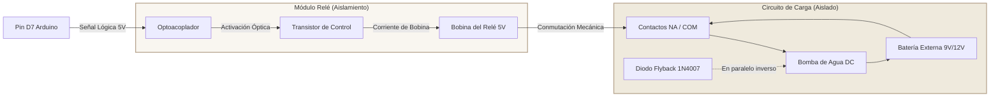

# Guía de Conexiones Eléctricas y Prevención de Daños (Buenas Prácticas Antiquema)

Esta guía detalla el diseño de conexiones para el **Sistema de Riego Inteligente** en simuladores como **Tinkercad Circuits** o **Proteus VSM**. El objetivo es garantizar la estabilidad de las lecturas analógicas y proteger los componentes electrónicos contra sobrecorrientes, cortocircuitos o picos inductivos de potencia.

---

## 1. Protección de Salidas Digitales (Diodos LED)

Los diodos LED son dispositivos semiconductores sensibles a la corriente. Conectarlos directamente a un pin digital del microcontrolador (que suministra 5V) provocaría una corriente destructiva, dañando el LED y sobrecargando el pin GPIO de salida del microcontrolador (cuyo límite recomendado es 20 mA).

### Cálculo de la Resistencia Limitadora
Para determinar el valor adecuado de la resistencia ($R$) en serie con el LED, se aplica la Ley de Ohm:

$$R = \frac{V_{cc} - V_{led}}{I_{led}}$$

Donde:
*   $V_{cc}$ (Voltaje de alimentación): **5.0 V** (suministrado por el Arduino).
*   $V_{led}$ (Caída de tensión típica del LED):
    *   LED Rojo: **~2.0 V**
    *   LED Verde: **~2.1 V**
*   $I_{led}$ (Corriente nominal de funcionamiento): **10 mA a 15 mA** (0.010 A - 0.015 A) para una iluminación óptima y segura.

#### Cálculo para LED Rojo:
$$R = \frac{5.0\text{ V} - 2.0\text{ V}}{0.010\text{ A}} = 300\ \Omega$$

*   **Resistencia recomendada**: Un valor comercial común de **220 $\Omega$ a 330 $\Omega$**.
    *   Con **220 $\Omega$**: $I_{led} \approx 13.6\text{ mA}$ (seguro y brillante).
    *   Con **330 $\Omega$**: $I_{led} \approx 9.0\text{ mA}$ (consumo reducido).

---

## 2. Aislamiento de Potencia e Inducción (Bomba de Agua / Motor DC)

El motor de corriente continua (bomba de agua) es una **carga inductiva**. Cuando el motor se enciende o se apaga, los campos magnéticos en sus bobinados colapsan y generan un pico de fuerza contraelectromotriz (voltaje inverso) que puede superar los 100 V. Si este motor se conecta directamente a un pin de la placa Arduino:
1.  Superará el límite de corriente del pin (el motor requiere > 100 mA; el pin soporta un máximo de 40 mA).
2.  El pico inductivo quemará inmediatamente el transistor interno del chip microcontrolador (ATmega328P).

### Solución: Acoplamiento por Relé y Aislamiento Eléctrico

Para mitigar estos riesgos se implementa un circuito con **módulo relé optoacoplado** y una **fuente de alimentación externa**:

### Componentes Clave de Seguridad:
1.  **Optoacoplador (aislamiento óptico):** Separa físicamente el circuito de control del de potencia mediante un haz de luz interno (infrarrojo). No hay conexión eléctrica directa entre el pin D7 y el circuito del relé si se retira el jumper de puenteo `JD-VCC`.
2.  **Diodo Flyback (1N4007):** Conectado en paralelo e inversa con el motor DC. Su función es cortocircuitar con seguridad la corriente autogenerada por el motor cuando se desenergiza, protegiendo los contactos del relé de arcos eléctricos.
3.  **Fuente de Alimentación Independiente:** El motor debe energizarse mediante una batería externa (ej. de 9V o fuente externa) y **nunca** conectarse a la línea de 5V del Arduino, evitando caídas de voltaje que reinicien el microcontrolador.

---

## 3. Prevención de Estados Flotantes (Entradas Digitales)

Si se añadieran pulsadores físicos para el control manual en la placa, las entradas digitales quedarían en un estado "flotante" (alta impedancia, ni HIGH ni LOW) cuando el botón no está presionado. Esto introduce ruido electromagnético y lecturas erráticas.
*   **Buenas Prácticas:** Configurar los pines de entrada con resistencias de **Pull-Up activas** por software (`INPUT_PULLUP` en Arduino) o soldar una resistencia física de **10 k$\Omega$** conectada a GND (Pull-Down) o a VCC (Pull-Up).
*   En nuestro circuito simulado de sensores analógicos (A0, A1, A2), la salida del sensor Higrómetro y los divisores de voltaje de LDR/TMP36 actúan como referencias fijas de bajo ruido, evitando el estado flotante.

---

## 4. Matriz de Conexiones de Hardware Simulada

| Componente | Tipo de Señal | Pin Arduino | Notas de Montaje Seguro |
| :--- | :--- | :--- | :--- |
| **Sensor de Humedad (Higrómetro)** | Analógica | `A0` | Conectar VCC a 5V y GND a tierra común. |
| **Sensor de Temperatura (TMP36)** | Analógica | `A1` | Conectar VCC a 5V, OUT a A1 y GND a tierra. |
| **Fotorresistencia (LDR)** | Analógica | `A2` | Configurar como divisor de tensión con resistencia de 10 k$\Omega$. |
| **Módulo Relé (Bomba)** | Digital | `D7` | Controla la conmutación de la bomba de agua con alimentación externa. |
| **LED Verde (OK)** | Digital | `D8` | Conectar en serie con resistencia de 220 $\Omega$ o 330 $\Omega$ hacia GND. |
| **LED Rojo (Alerta)** | Digital | `D9` | Conectar en serie con resistencia de 220 $\Omega$ o 330 $\Omega$ hacia GND. |
| **Pantalla LCD 16x2 (I2C)** | Protocolo | `A4` (SDA) / `A5` (SCL) | Requiere alimentación de 5V y GND. Utiliza el bus de comunicaciones I2C. |
